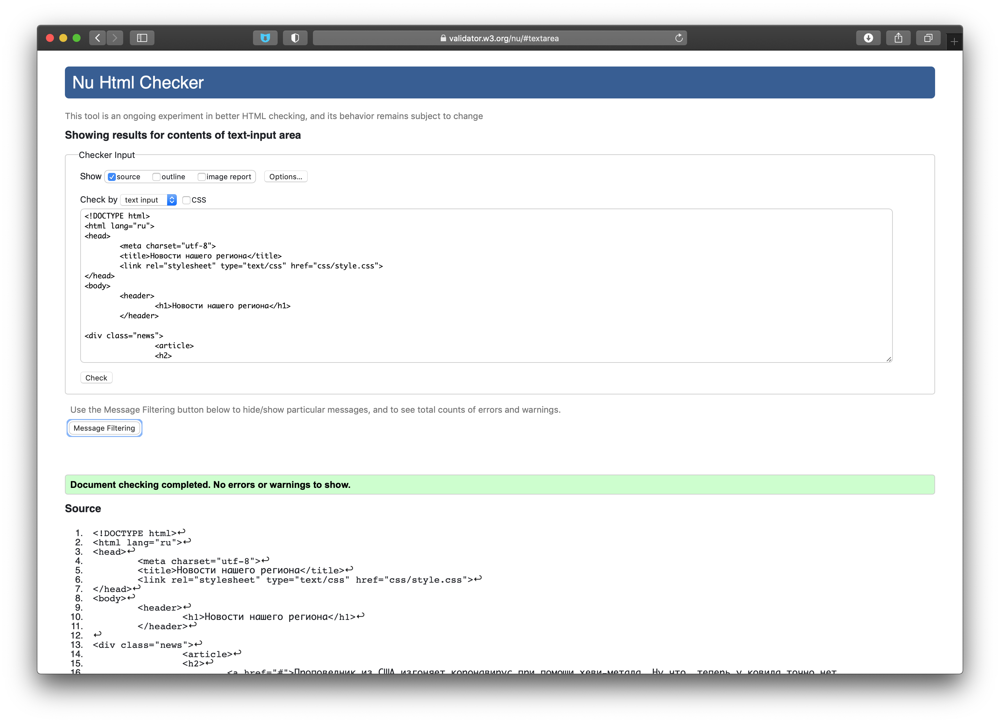
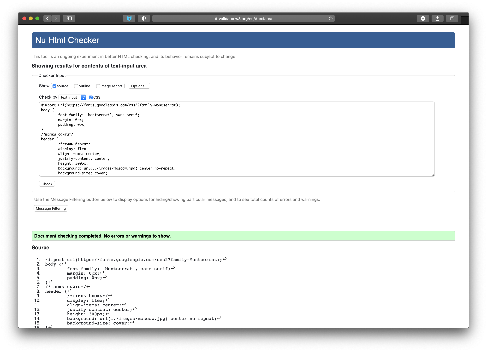

# Задание 5.6 
## [Новостная страница](https://nmvil.github.io/task_6.10/index.html)
## Используемые технологии

* HTML
* CSS
* Web-fonts ([Montserrat](https://fonts.googleapis.com/css2?family=Montserrat))

## Результаты проверки через [Validator W3C](https://validator.w3.org/
)

1. index.html:

2. style.css
